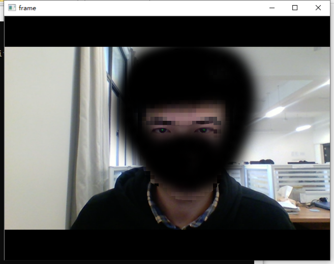

## 介绍
## About
Real-time python eye tracking base on Fast Radial Symmetry Transform.  
基于python的快速径向对称变换的实时瞳孔中心定位。

## Dependence
## 依赖
* python 3
* opencv3 (or opencv4)

## Run
## 运行
```
python tracking.py
```

## Result
## 结果


## Tune the parameters
## 调整参数
If it is unstable, you can tune the parameters:  
如果比较飘，可以调整一下参数，调一下:  

`eye_radius = int(0.1 * (e_right.shape)[1])`  
`gray_threshold = 40`

## Thanks
## 致谢
1. [frst](https://github.com/Xonxt/frst)  
2. [Loy G , Zelinsky A . A Fast Radial Symmetry Transform for Detecting Points of Interest[C]// European Conference on Computer Vision. Springer Berlin Heidelberg, 2002.](https://link.springer.com/chapter/10.1007%2F3-540-47969-4_24)  
3. [ftst(python)](https://pypi.org/project/frst/)  

## Other
## 其他
The file frst1.py has not been completed yet. It is expected to be superimposed with multiple radii to make the positioning more precise. It was stable at first, and then I change something that i didn't remembered then it was broken. I have no time to finish it recently.  

frst1.py暂未完成,预想用多个半径叠加，使定位更加精确，不知道怎么回事，一开始是挺稳定，后来调坏了，目前没时间搞。
